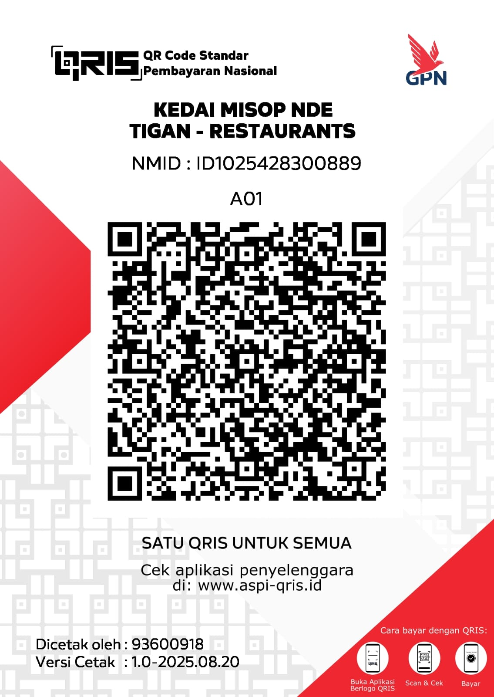

<?php

include "includes/config.php";

cekLogin();

/* ==============================
   TOTAL MENU
============================== */

$qMenu=query("SELECT COUNT(*) AS total FROM menu");
$totalMenu=fetch($qMenu)['total'];

/* ==============================
   TOTAL TRANSAKSI
============================== */

$qTrans=query("SELECT COUNT(*) AS total FROM transaksi");
$totalTransaksi=fetch($qTrans)['total'];

/* ==============================
   TOTAL PENDAPATAN
============================== */

$qPendapatan=query("SELECT SUM(total) AS total FROM transaksi");
$dataPendapatan=fetch($qPendapatan);

$totalPendapatan=$dataPendapatan['total'] ?? 0;

/* ==============================
   MENU TERLARIS
============================== */

$qBest=query("

SELECT

menu.nama,

SUM(detail_transaksi.qty) AS jumlah

FROM detail_transaksi

JOIN menu

ON menu.id=detail_transaksi.menu_id

GROUP BY menu.id

ORDER BY jumlah DESC

LIMIT 5

");

?>

<!DOCTYPE html>

<html lang="id">

<head>

<meta charset="UTF-8">

<meta name="viewport"
content="width=device-width,initial-scale=1.0">

<title>Dashboard</title>

<link rel="stylesheet"
href="assets/css/style.css">

<link rel="stylesheet"
href="assets/css/dashboard.css">

<link rel="stylesheet"
href="https://cdnjs.cloudflare.com/ajax/libs/font-awesome/6.7.2/css/all.min.css">

</head>

<body>

<?php include "components/sidebar.php"; ?>

<?php include "components/navbar.php"; ?>

<h2>

Dashboard

</h2>

Selamat datang,

<b><?= e($_SESSION['nama']) ?></b>

👋

<i class="fa-solid fa-utensils"></i>

<h3>

<?= angka($totalMenu) ?>

</h3>

Total Menu

<i class="fa-solid fa-receipt"></i>

<h3>

<?= angka($totalTransaksi) ?>

</h3>

Total Transaksi

<i class="fa-solid fa-money-bill-wave"></i>

<h3>

<?= rupiah($totalPendapatan) ?>

</h3>

Total Pendapatan

<h3>

🔥 Menu Terlaris

</h3>

<table>

<thead>

<tr>

<th>No</th>

<th>Nama Menu</th>

<th>Terjual</th>

</tr>

</thead>

<tbody>

<?php

$no=1;

while($row=fetch($qBest)):

?>

<tr>

<td><?= $no++ ?></td>

<td><?= e($row['nama']) ?></td>

<td><?= angka($row['jumlah']) ?></td>

</tr>

<?php endwhile; ?>

</tbody>

</table>

© <?= date("Y") ?>

Kedai Misop Nde Tigan

</body>

</html>
<?php

include "includes/config.php";

cekLogin();

if(!isset($_GET['id'])){

redirect("laporan.php");

}

$id=(int)$_GET['id'];

$trx=query("

SELECT *

FROM transaksi

WHERE id='$id'

");

$data=fetch($trx);

if(!$data){

redirect("laporan.php");

}

$detail=query("

SELECT

menu.nama,

detail_transaksi.qty,

detail_transaksi.harga,

detail_transaksi.subtotal

FROM detail_transaksi

JOIN menu

ON menu.id=detail_transaksi.menu_id

WHERE transaksi_id='$id'

");

?>

<!DOCTYPE html>

<html lang="id">

<head>

<meta charset="UTF-8">

<meta name="viewport"
content="width=device-width,initial-scale=1">

<title>Detail Transaksi</title>

<link rel="stylesheet"
href="assets/css/style.css">

<link rel="stylesheet"
href="https://cdnjs.cloudflare.com/ajax/libs/font-awesome/6.7.2/css/all.min.css">

</head>

<body>

<?php include "components/sidebar.php"; ?>

<?php include "components/navbar.php"; ?>

<h2>

📋 Detail Transaksi

</h2>

<?= kodeTransaksi($id) ?>

<b>Customer</b>

 

<?= e($data['customer']) ?>

<b>Kasir</b>

 

<?= e($data['kasir']) ?>

<b>Tanggal</b>

 

<?= tanggalIndonesia($data['tanggal']) ?>

<table>

<thead>

<tr>

<th>No</th>

<th>Menu</th>

<th>Harga</th>

<th>Qty</th>

<th>Subtotal</th>

</tr>

</thead>

<tbody>

<?php

$no=1;

while($row=fetch($detail)):

?>

<tr>

<td><?= $no++ ?></td>

<td><?= e($row['nama']) ?></td>

<td><?= rupiah($row['harga']) ?></td>

<td><?= angka($row['qty']) ?></td>

<td><?= rupiah($row['subtotal']) ?></td>

</tr>

<?php endwhile; ?>

</tbody>

<tfoot>

<tr>

<th colspan="4">

Subtotal

</th>

<th>

<?= rupiah($data['subtotal']) ?>

</th>

</tr>

<tr>

<th colspan="4">

Diskon

</th>

<th>

<?= rupiah($data['diskon']) ?>

</th>

</tr>

<tr>

<th colspan="4">

Pajak

</th>

<th>

<?= rupiah($data['pajak']) ?>

</th>

</tr>

<tr>

<th colspan="4">

Grand Total

</th>

<th>

<?= rupiah($data['total']) ?>

</th>

</tr>

</tfoot>

</table>

<a

href="laporan.php"

class="btn btn-secondary">

← Kembali

</a>

 

    <a
    href="struk.php?id=<?= $id ?>"
    class="btn btn-danger"
    target="_blank">

        <i class="fa-solid fa-file-pdf"></i>

        Cetak PDF

    </a>

© <?= date("Y") ?>

<?= APP_NAME ?>

</body>

</html>
<?php

include "includes/config.php";

cekLogin();

/*====================================
    FILTER
====================================*/

$tanggalAwal = $_GET['awal'] ?? "";
$tanggalAkhir = $_GET['akhir'] ?? "";

/*====================================
    QUERY
====================================*/

$sql = "SELECT * FROM transaksi";

if($tanggalAwal != "" && $tanggalAkhir != ""){

    $sql .= " WHERE DATE(tanggal)
              BETWEEN '$tanggalAwal'
              AND '$tanggalAkhir'";

}

$sql .= " ORDER BY tanggal DESC";

$data = query($sql);

/*====================================
    HEADER EXCEL
====================================*/

header("Content-Type: application/vnd.ms-excel");
header("Content-Disposition: attachment; filename=Laporan_Transaksi_".date("Ymd_His").".xls");

/*====================================
    OUTPUT
====================================*/

echo "<table border='1'>";

echo "<tr style='background:#198754;color:#ffffff;font-weight:bold;'>";

echo "<th>No</th>";
echo "<th>Kode</th>";
echo "<th>Tanggal</th>";
echo "<th>Customer</th>";
echo "<th>Kasir</th>";
echo "<th>Metode</th>";
echo "<th>Subtotal</th>";
echo "<th>Diskon</th>";
echo "<th>Pajak</th>";
echo "<th>Total</th>";
echo "<th>Bayar</th>";
echo "<th>Kembalian</th>";

echo "</tr>";

$no = 1;
$totalPendapatan = 0;

while($row = fetch($data)){

    $totalPendapatan += $row['total'];

    echo "<tr>";

    echo "<td>".$no++."</td>";
    echo "<td>".kodeTransaksi($row['id'])."</td>";
    echo "<td>".tanggalIndonesia($row['tanggal'])."</td>";
    echo "<td>".$row['customer']."</td>";
    echo "<td>".$row['kasir']."</td>";
    echo "<td>".$row['metode']."</td>";
    echo "<td>".$row['subtotal']."</td>";
    echo "<td>".$row['diskon']."</td>";
    echo "<td>".$row['pajak']."</td>";
    echo "<td>".$row['total']."</td>";
    echo "<td>".$row['bayar']."</td>";
    echo "<td>".$row['kembalian']."</td>";

    echo "</tr>";

}

echo "<tr>";

echo "<td colspan='9' align='right'><b>Total Pendapatan</b></td>";

echo "<td><b>".$totalPendapatan."</b></td>";

echo "<td colspan='2'></td>";

echo "</tr>";

echo "</table>";

exit;
<?php

include "includes/config.php";

cekLogin();

/*==========================================
    DATA GRAFIK 7 HARI TERAKHIR
==========================================*/

$dataGrafik=query("

SELECT

DATE(tanggal) AS tanggal,

SUM(total) AS pendapatan

FROM transaksi

WHERE tanggal>=DATE_SUB(CURDATE(),INTERVAL 6 DAY)

GROUP BY DATE(tanggal)

ORDER BY DATE(tanggal)

");

$label=[];

$nilai=[];

while($row=fetch($dataGrafik)){

    $label[]=date("d/m",strtotime($row['tanggal']));

    $nilai[]=(int)$row['pendapatan'];

}

?>

<!DOCTYPE html>

<html lang="id">

<head>

<meta charset="UTF-8">

<meta name="viewport"
content="width=device-width,initial-scale=1">

<title>Grafik Penjualan</title>

<link rel="stylesheet"
href="assets/css/style.css">

<link rel="stylesheet"
href="assets/css/grafik.css">

<link rel="stylesheet"
href="https://cdnjs.cloudflare.com/ajax/libs/font-awesome/6.7.2/css/all.min.css">

</head>

<body>

<?php include "components/sidebar.php"; ?>

<?php include "components/navbar.php"; ?>

<h2>

📈 Grafik Penjualan

</h2>

Pendapatan 7 hari terakhir

<canvas id="grafikPenjualan"></canvas>

© <?= date("Y") ?>

<?= APP_NAME ?>

</body>

</html>
<?php

include "includes/config.php";

/*==========================================
    CEK LOGIN
==========================================*/

if(isset($_SESSION['login'])){

    header("Location: dashboard.php");

}else{

    header("Location: login.php");

}

exit;

?>
<?php

include "includes/config.php";

cekLogin();

// ===============================
// AMBIL DATA MENU
// ===============================

$menu = query("
SELECT *
FROM menu
WHERE stok > 0
ORDER BY kategori,nama
");

?>

<!DOCTYPE html>
<html lang="id">

<head>

<meta charset="UTF-8">

<meta name="viewport" content="width=device-width, initial-scale=1.0">

<title>Kasir</title>

<link rel="stylesheet" href="assets/css/style.css">

<link rel="stylesheet" href="assets/css/kasir.css">

<link rel="stylesheet"
href="https://cdnjs.cloudflare.com/ajax/libs/font-awesome/6.7.2/css/all.min.css">

</head>

<body>

<?php include "components/sidebar.php"; ?>

<?php include "components/navbar.php"; ?>

<h2>💳 Kasir</h2>

Silakan pilih menu yang akan dipesan.

<form
action="proses/simpan_transaksi.php"
method="POST"
id="formKasir">

<!-- ===================================
     MENU
=================================== -->

<?php while($m = fetch($menu)): ?>

"
data-nama="<?= e($m['nama']) ?>"
data-harga="<?= $m['harga'] ?>"
data-stok="<?= $m['stok'] ?>">

"
alt="<?= e($m['nama']) ?>">

<h4><?= e($m['nama']) ?></h4>

<?= e($m['kategori']) ?>

<h3><?= rupiah($m['harga']) ?></h3>

Stok :
<?= angka($m['stok']) ?>

<button
type="button"
class="btn btn-primary tambah">

Tambah

</button>

<?php endwhile; ?>

<!-- ===================================
     KERANJANG
=================================== -->

<h3>

🛒 Keranjang

</h3>

Belum ada menu dipilih.

<!-- ===================================
     CUSTOMER
=================================== -->

<label>

Nama Customer

</label>

<input
type="text"
name="customer"
id="customer"
placeholder="Masukkan nama customer"
required>

<!-- ===================================
     METODE PEMBAYARAN
=================================== -->

<label>

Metode Pembayaran

</label>

<select
name="metode"
id="metode"
required>

<option value="Tunai">

💵 Tunai

</option>

<option value="QRIS">

📱 QRIS

</option>

</select>

<!-- ===================================
     RINGKASAN BELANJA
=================================== -->

    

        Subtotal

        Rp 0

    

    

        Diskon

        Rp 0

    

    

        Pajak (10%)

        Rp 0

    

    

        <strong>Total</strong>

        <strong id="totalText">Rp 0</strong>

    

<!-- ===================================
     PEMBAYARAN
=================================== -->

    <label>Bayar</label>

    <input

        type="number"

        name="bayar"

        id="bayar"

        min="0"

        placeholder="Masukkan nominal pembayaran"

        required>

    <label>Kembalian</label>

    <input

        type="text"

        id="kembalian"

        value="Rp 0"

        readonly>

<!-- ===================================
     HIDDEN INPUT
=================================== -->

<input
type="hidden"
name="subtotal"
id="subtotal">

<input
type="hidden"
name="diskon"
id="diskon">

<input
type="hidden"
name="pajak"
id="pajak">

<input
type="hidden"
name="total"
id="total">

<input
type="hidden"
name="cart"
id="cartData">

<button

type="submit"

class="btn btn-primary w-100"

id="btnSimpan">

<i class="fa-solid fa-floppy-disk"></i>

Simpan Transaksi

</button>

</form>

<!-- ===================================
        MODAL QRIS
=================================== -->

<h2>

Pembayaran QRIS

</h2>

Kedai Misop Nde Tigan

Total Pembayaran

<h3 id="totalQris">

Rp 0

</h3>

Sisa Waktu

<h1 id="timerQris">

01:00

</h1>

Silakan scan QR Code menggunakan

Mobile Banking atau E-Wallet.

<button

type="button"

class="btn btn-success"

id="btnKonfirmasi">

<i class="fa-solid fa-circle-check"></i>

Saya Sudah Menerima Pembayaran

</button>

<button

type="button"

class="btn btn-danger"

id="btnBatal">

<i class="fa-solid fa-xmark"></i>

Batalkan

</button>

<!-- ===============================
     FOOTER
================================ -->

© <?= date("Y") ?>

<?= APP_NAME ?>

<!-- ===============================
     JAVASCRIPT
================================ -->

</body>

</html>
<?php

include "includes/config.php";

cekLogin();

/*==================================
    FILTER TANGGAL
==================================*/

$tanggalAwal=$_GET['awal'] ?? "";
$tanggalAkhir=$_GET['akhir'] ?? "";

$sql="SELECT * FROM transaksi";

if($tanggalAwal!="" && $tanggalAkhir!=""){

$sql.=" WHERE DATE(tanggal)
BETWEEN '$tanggalAwal'
AND '$tanggalAkhir'";

}

$sql.=" ORDER BY id DESC";

$data=query($sql);

?>
<!DOCTYPE html>

<html lang="id">

<head>

<meta charset="UTF-8">

<meta name="viewport"
content="width=device-width,initial-scale=1">

<title>Laporan</title>

<link rel="stylesheet"
href="assets/css/style.css">

<link rel="stylesheet"
href="assets/css/laporan.css">

<link rel="stylesheet"
href="https://cdnjs.cloudflare.com/ajax/libs/font-awesome/6.7.2/css/all.min.css">

</head>

<body>

<?php include "components/sidebar.php"; ?>

<?php include "components/navbar.php"; ?>

<h2>

📄 Laporan Transaksi

</h2>

Riwayat seluruh transaksi.

    <a
    href="export_excel.php"
    class="btn btn-success">

        <i class="fa-solid fa-file-excel"></i>

        Export Excel

    </a>

<form method="GET" class="filter">

<label>Tanggal Awal</label>

<input
type="date"
name="awal"
value="<?= e($tanggalAwal) ?>">

<label>Tanggal Akhir</label>

<input
type="date"
name="akhir"
value="<?= e($tanggalAkhir) ?>">

<label>&nbsp;</label>

<button
class="btn btn-primary">

Filter

</button>

</form>

<table>

<thead>

<tr>

<th>No</th>

<th>Kode</th>

<th>Tanggal</th>

<th>Customer</th>

<th>Kasir</th>

<th>Total</th>

<th>Aksi</th>

</tr>

</thead>

<tbody>

<?php

$no=1;

$totalPendapatan=0;

while($row=fetch($data)):

$totalPendapatan+=$row['total'];

?>

<tr>

<td><?= $no++ ?></td>

<td><?= kodeTransaksi($row['id']) ?></td>

<td><?= tanggalIndonesia($row['tanggal']) ?></td>

<td><?= e($row['customer']) ?></td>

<td><?= e($row['kasir']) ?></td>

<td><?= rupiah($row['total']) ?></td>

<td>

<a
href="detail_transaksi.php?id=<?= $row['id'] ?>"
class="btn btn-warning">

<i class="fa-solid fa-eye"></i>

Detail

</a>

</td>

</tr>

<?php endwhile; ?>

</tbody>

<tfoot>

<tr style="background:#198754;color:white;">

    <td></td>

    <td style="font-weight:bold;">
        💰 Total Pendapatan
    </td>

    <td></td>

    <td></td>

    <td></td>

    <td style="font-weight:bold;">
        <?= rupiah($totalPendapatan) ?>
    </td>

    <td>

      <a
href="export_excel.php?awal=<?= e($tanggalAwal) ?>&akhir=<?= e($tanggalAkhir) ?>"
class="btn btn-success">

    <i class="fa-solid fa-file-excel"></i>

    Export Excel

</a>

    </td>

</tr>

</tfoot>

</table>
 

© <?= date("Y") ?>

<?= APP_NAME ?>

</body>

</html>
<?php

include "includes/config.php";

// Jika sudah login langsung ke dashboard
if(isset($_SESSION['login'])){
    redirect("dashboard.php");
}

// Proses Login
if(isset($_POST['login'])){

    $username = mysqli_real_escape_string($conn,$_POST['username']);
    $password = md5($_POST['password']);

    $query = query("
        SELECT *
        FROM user
        WHERE username='$username'
        AND password='$password'
    ");

    if(rows($query)>0){

        $user = fetch($query);

        $_SESSION['login'] = true;
        $_SESSION['id'] = $user['id'];
        $_SESSION['nama'] = $user['nama'];
        $_SESSION['username'] = $user['username'];
        $_SESSION['role'] = $user['role'];

        redirect("dashboard.php");

    }else{

        setFlash("Username atau Password salah!","danger");

    }

}

?>

<!DOCTYPE html>

<html lang="id">

<head>

<meta charset="UTF-8">

<meta name="viewport" content="width=device-width, initial-scale=1.0">

<title>Login | <?= APP_NAME ?></title>

<link rel="stylesheet" href="assets/css/style.css">
<link rel="stylesheet" href="assets/css/login.css">

<link rel="stylesheet"
href="https://cdnjs.cloudflare.com/ajax/libs/font-awesome/6.7.2/css/all.min.css">

</head>

<body>

    

    

        

    

    <h2>Kedai Misop Nde Tigan</h2>

    
Silakan login untuk melanjutkan

        <?php tampilFlash(); ?>

        <form method="POST">

            

                <label>Username</label>

                <input
                type="text"
                name="username"
                placeholder="Masukkan Username"
                required>

            

            

                <label>Password</label>

                <input
                type="password"
                name="password"
                placeholder="Masukkan Password"
                required>

            

            <button
            class="btn btn-primary w-100"
            type="submit"
            name="login">

                <i class="fa-solid fa-right-to-bracket"></i>

                Login

            </button>

        </form>

    

</body>

</html>
<?php

session_start();

session_unset();

session_destroy();

header("Location: index.php");

exit;

?>
<?php

include "includes/config.php";

cekLogin();
if($_SESSION['role']!="Admin"){

    header("Location: dashboard.php");

    exit;

}

$data=query("

SELECT *

FROM menu

ORDER BY kategori,nama

");

?>

<!DOCTYPE html>

<html lang="id">

<head>

<meta charset="UTF-8">

<meta name="viewport"
content="width=device-width,initial-scale=1.0">

<title>Data Menu</title>

<link rel="stylesheet"
href="assets/css/style.css">

<link rel="stylesheet"
href="assets/css/menu.css">

<link rel="stylesheet"
href="https://cdnjs.cloudflare.com/ajax/libs/font-awesome/6.7.2/css/all.min.css">

</head>

<body>

<?php include "components/sidebar.php"; ?>

<?php include "components/navbar.php"; ?>

<h2>

🍜 Data Menu

</h2>

Daftar menu Kedai Misop Nde Tigan

    

<input

type="text"

id="searchMenu"

placeholder="🔍 Cari nama menu...">

<table>

<thead>

<tr>

<th>No</th>

<th>Gambar</th>

<th>Nama</th>

<th>Kategori</th>

<th>Harga</th>

<th>Stok</th>

</tr>

</thead>

<tbody>

<?php

$no=1;

while($menu=fetch($data)):

?>

<tr>

<td>

<?= $no++ ?>

</td>

<td>

"

width="70"

style="border-radius:10px;">

</td>

<td>

<?= e($menu['nama']) ?>

</td>

<td>

<?= e($menu['kategori']) ?>

</td>

<td>

<?= rupiah($menu['harga']) ?>

</td>

<td>

<?= angka($menu['stok']) ?>

</td>

</tr>

<?php endwhile; ?>

</tbody>

</table>

© <?= date("Y") ?>

Kedai Misop Nde Tigan

</body>

</html>
<?php

include "includes/config.php";

cekLogin();

/*====================================
    JUDUL PROFIL
====================================*/

$role = strtolower(trim($_SESSION['role']));

$judulProfil = ($role == "admin")
    ? "Profil Admin"
    : "Profil Kasir";

/*====================================
    FOTO PROFIL
====================================*/

$fotoProfil = "assets/img/profil.jpg";

?>

<!DOCTYPE html>

<html lang="id">

<head>

<meta charset="UTF-8">

<meta name="viewport" content="width=device-width, initial-scale=1">

<title><?= $judulProfil ?></title>

<link rel="stylesheet" href="assets/css/style.css">
<link rel="stylesheet" href="assets/css/profil.css">

<link rel="stylesheet"
href="https://cdnjs.cloudflare.com/ajax/libs/font-awesome/6.7.2/css/all.min.css">

</head>

<body>

<?php include "components/sidebar.php"; ?>

<?php include "components/navbar.php"; ?>

<h2>

👤 <?= $judulProfil ?>

</h2>

Informasi akun yang sedang login.

<?php if(file_exists($fotoProfil)): ?>

"
alt="Foto Profil"
style="
width:120px;
height:120px;
border-radius:50%;
object-fit:cover;
border:4px solid #198754;
">

<?php else: ?>

<i class="fa-solid fa-user"></i>

<?php endif; ?>

<table>

<tr>

<td width="180">

Nama

</td>

<td>

: <?= e($_SESSION['nama']) ?>

</td>

</tr>

<tr>

<td>

Username

</td>

<td>

: <?= e($_SESSION['username']) ?>

</td>

</tr>

<tr>

<td>

Role

</td>

<td>

: <?= e($_SESSION['role']) ?>

</td>

</tr>

<tr>

<td>

Login Terakhir

</td>

<td>

: <?= date("d F Y H:i") ?>

</td>

</tr>

</table>

© <?= date("Y") ?>

<?= APP_NAME ?>

</body>

</html>
<?php

include "includes/config.php";

cekLogin();

if(!isset($_GET['id'])){

redirect("dashboard.php");

}

$id=(int)$_GET['id'];

$trx=query("

SELECT *

FROM transaksi

WHERE id='$id'

");

$data=fetch($trx);

$detail=query("

SELECT

menu.nama,

detail_transaksi.qty,

detail_transaksi.harga,

detail_transaksi.subtotal

FROM detail_transaksi

JOIN menu

ON menu.id=detail_transaksi.menu_id

WHERE transaksi_id='$id'

");

?>

<!DOCTYPE html>

<html>

<head>

<meta charset="UTF-8">

<title>Struk</title>

<link rel="stylesheet"

href="assets/css/style.css">

</head>

<body>

<h2>

🍜 Kedai Misop

</h2>

Nde Tigan

<b>

<?= kodeTransaksi($id) ?>

</b>

 

<?= tanggalIndonesia($data['tanggal']) ?>

 

Kasir :

<?= e($data['kasir']) ?>

 

Customer :

<?= e($data['customer']) ?>

<table>

<?php while($row=fetch($detail)): ?>

<tr>

<td>

<?= e($row['nama']) ?>

 

<small>

<?= rupiah($row['harga']) ?>

x

<?= angka($row['qty']) ?>

</small>

</td>

<td align="right">

<?= rupiah($row['subtotal']) ?>

</td>

</tr>

<?php endwhile; ?>

</table>

<table>

<tr>

<td>

Subtotal

</td>

<td align="right">

<?= rupiah($data['subtotal']) ?>

</td>

</tr>

<tr>

<td>

Diskon

</td>

<td align="right">

<?= rupiah($data['diskon']) ?>

</td>

</tr>

<tr>

<td>

Pajak

</td>

<td align="right">

<?= rupiah($data['pajak']) ?>

</td>

</tr>

<tr>

<td>

<b>Total</b>

</td>

<td align="right">

<b>

<?= rupiah($data['total']) ?>

</b>

</td>

</tr>

<tr>

<td>

Bayar

</td>

<td align="right">

<?= rupiah($data['bayar']) ?>

</td>

</tr>

<tr>

<td>

Kembalian

</td>

<td align="right">

<?= rupiah($data['kembalian']) ?>

</td>

</tr>

<tr>

<td>

Metode

</td>

<td align="right">

<?= e($data['metode']) ?>

</td>

</tr>

</table>

Terima Kasih 😊

Selamat Menikmati

 

<button

onclick="window.print()"

class="btn btn-primary">

🖨 Cetak Struk

</button>

<a

href="kasir.php"

class="btn btn-secondary">

← Kembali

</a>

</body>

</html>
